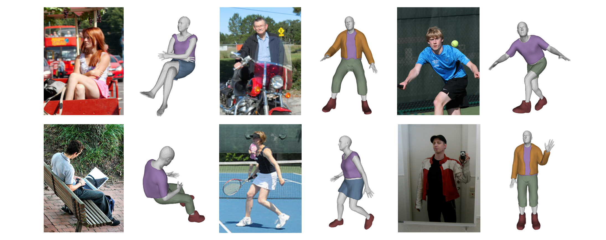

#### Deep Learning
+ [Not Every Model Has a Separate "Loss Function" - Yuxin's Blog (ppwwyyxx.com)](https://ppwwyyxx.com/blog/2022/Loss-Function-Separation/)

#### Python
+ [Buffers on the edge: Python and Rust · Alex Gaynor](https://alexgaynor.net/2022/oct/23/buffers-on-the-edge/)
+ [Python 工匠：语句、表达式和海象操作符](https://www.zlovezl.cn/articles/stmt-expr-and-walrus-operator/)
+ [The Perfect Commit (simonwillison.net)](https://simonwillison.net/2022/Oct/29/the-perfect-commit/)

#### Mobile Develop
+ [How Meta switched Android development to Kotlin](https://tech.fb.com/engineering/2022/10/kotlin-meta-migration-java/)

#### Paper
+ [3D Clothed Human Reconstruction in the Wild](https://arxiv.org/abs/2207.10053)

#### Career
+ [I'm leaving Amadeus after 9 years](https://www.sandordargo.com/blog/2022/10/19/last-days-at-amadeus-after-nine-years)
+ [Weeknotes: DjangoCon, SQLite in Django, datasette-gunicorn (simonwillison.net)](https://simonwillison.net/2022/Oct/23/datasette-gunicorn/)

#### Release Note
+ [PyTorch 1.13 release, including beta versions of functorch and improved support for Apple’s new M1 chips.](https://pytorch.org/blog/PyTorch-1.13-release/)
+ [Python Release Python 3.11.0](https://www.python.org/downloads/release/python-3110/)
+ [Open Images V7 — Now Featuring Point Labels – Google AI Blog (googleblog.com)](https://ai.googleblog.com/2022/10/open-images-v7-now-featuring-point.html)
