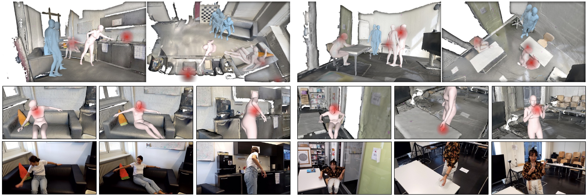
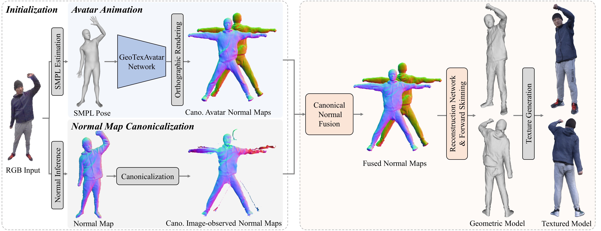

## week-00002 (2022.10.31-2022.11.06)
#### AI
+ [EgoBody: Human Body Shape and Motion of Interacting People from Head-Mounted Devices (sanweiliti.github.io)](https://sanweiliti.github.io/egobody/egobody.html)

+ [AvatarCap's Project Page (liuyebin.com)](http://www.liuyebin.com/avatarcap/avatarcap.html)
 
+ [GitHub Copilot litigation · Joseph Saveri Law Firm & Matthew Butterick](https://githubcopilotlitigation.com/)
+ [hakurei/waifu-diffusion · Hugging Face](https://huggingface.co/hakurei/waifu-diffusion)

#### Python
+ [A pytest fixture for image similarity - Redshiftzero](https://www.redshiftzero.com/pytest-image/)
+ [Understanding the Python Mock Object Library – Real Python](https://realpython.com/python-mock-library/)
+ [Python 3.11 micro-benchmark](https://kracekumar.com/post/micro-benchmark-python-311/)

#### innovation
+ [Potluck: Dynamic documents as personal software (inkandswitch.com)](https://www.inkandswitch.com/potluck/)
+ [Weld](https://www.weld.rs/)

#### Programming Language
+ [Why Functional Programming Should Be the Future of Software Development - IEEE Spectrum](https://spectrum.ieee.org/functional-programming)

#### Career
+ [Software World Tour With Son Luong Ngoc - CoRecursive Podcast](https://corecursive.com/software-world-tour-with-son-luong-ngoc/#bonus-content-from-son)
+ [Dia Duit Dublin, Bye Bengaluru - Technical Ramblings (kracekumar.com)](https://kracekumar.com/post/dia-duit-dublin-bye-bengaluru/)

#### Community
+ [Open source sustainment and the future of Gitea - Blog](https://blog.gitea.io/2022/10/open-source-sustainment-and-the-future-of-gitea/)
+ https://godotengine.org/article/godots-graduation-godot-moves-to-a-new-foundation
+ [Godot Engine - Godot’s Graduation: Godot moves to a new Foundation](https://godotengine.org/article/godots-graduation-godot-moves-to-a-new-foundation)

